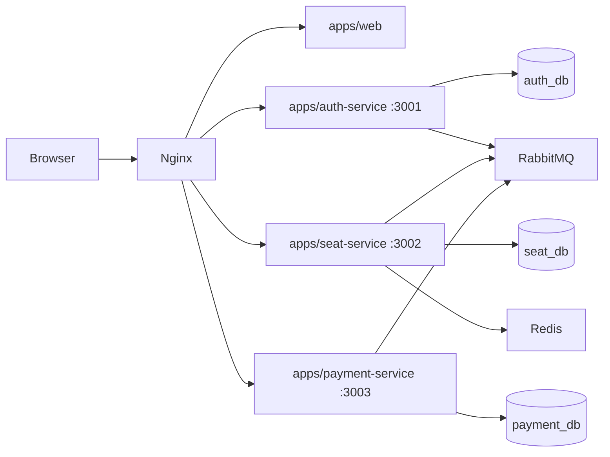

# Seat Reservation Assessment

Small public seat reservation platform built as a TypeScript microservice monorepo.

## Architecture



Each bounded context has its own entry point, Dockerfile, port, database migration folder, health endpoints, and deployable container:

- `apps/auth-service`: email/password auth, Argon2id password hashing, 90-day opaque refresh-token cookie, refresh rotation, reuse detection, audit log.
- `apps/seat-service`: public seat listing, atomic hold creation, hold expiry sweeper, reservation finalization from payment events, SSE updates.
- `apps/payment-service`: mock payment boundary, server-owned amount, HMAC webhook verification, webhook idempotency, compensation events.
- `apps/web`: Vite React UI that talks only through nginx `/api/*`.
- `packages/shared`: typed event contracts, env validation, logging, health helpers, rate limiting, metrics, broker/outbox helpers.

## Local Setup

1. Copy environment values:

   ```bash
   cp .env.example .env
   ```

2. Replace `JWT_ACCESS_SECRET` and `WEBHOOK_SECRET` with random 32+ byte values.

3. Start the full stack:

   ```bash
   docker compose up --build
   ```

4. Open [http://localhost:8080](http://localhost:8080).

Development demo credentials are seeded by auth-service:

- Email: `demo@example.com`
- Password: `Password123!`

## Smoke Test

After the compose stack is healthy:

```bash
npm install
npm run smoke
```

The smoke test registers a user, holds the first available seat, creates a payment intent, completes the mock payment, and verifies the seat becomes `RESERVED`.

## API Flow

1. `POST /api/auth/login` sets an httpOnly `refresh_token` cookie and returns a short-lived access token.
2. `GET /api/seats` displays the 3 seats.
3. `POST /api/seats/:seatId/hold` atomically holds a seat for the authenticated user.
4. Seat service writes `seat.held` to its outbox; RabbitMQ delivers it to payment-service.
5. `POST /api/payments/checkout` creates a payment intent using the server-side hold projection amount.
6. `POST /api/payments/mock/complete` simulates provider completion through the same HMAC-verified webhook processor.
7. Payment service publishes `payment.completed`.
8. Seat service consumes the event and reserves the held seat.

## Operational Hooks

- `GET /health/live`, `GET /health/ready`, and `GET /metrics` exist on every backend service.
- `docker-compose.yml` includes Postgres, Redis, RabbitMQ, nginx, healthchecks, and separate app containers.
- nginx defines request limit zones for login, API, and webhook routes.
- Postgres slow query and lock-wait logging are enabled in compose.
- Services use structured JSON logs with `action`, `traceId`, and service labels.
- SIGTERM handlers stop accepting requests and close DB, Redis, RabbitMQ, timers, and workers.

## Testing Notes

This repo includes a smoke test for the happy path and a concurrency test skeleton in `tests/concurrency.test.ts`. The concurrency-sensitive behavior is also enforced by Postgres:

- `SELECT ... FOR UPDATE` around seat hold transitions.
- `UNIQUE (current_holder_id) WHERE status = 'HELD'` for one active hold per user.
- `UNIQUE (hold_id)` on seats and payment intent uniqueness/idempotency keys.
- `webhook_events.stripe_event_id` primary key for webhook dedupe.
